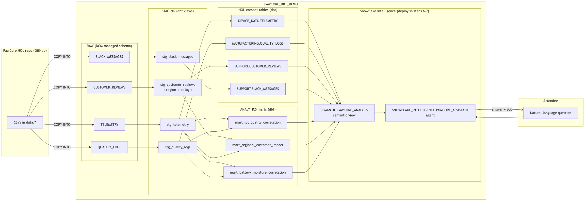
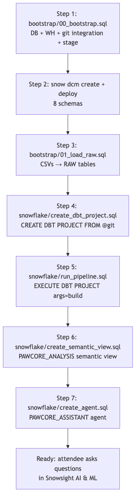

# Prompt to Pipeline: Cortex Code + dbt on Snowflake + DCM


A 60-minute hands-on lab that builds a complete, production-shaped Snowflake data pipeline for PawCore (smart pet collar manufacturer) using:

- **Cortex Code (CoCo)** — Snowflake's AI coding agent, used as a pair programmer to generate dbt models, tests, and DCM schemas from natural-language prompts.
- **dbt Projects on Snowflake** — native dbt runs directly in Snowflake, no external host.
- **Database Change Management (DCM)** — git-backed, reviewable, repeatable schema deployments.

The tables this pipeline lands are the exact shape the [Cortex AI + Snowflake Intelligence HOL](https://github.com/sfc-gh-calexander/HandsOnLabs/tree/main/1-Cortex-AI-Snowflake-Intelligence) semantic view expects, so you can layer a Cortex Agent on top in minutes.

## Architecture

**Data flow** — CSVs in the upstream HOL repo land in `RAW`, dbt builds staging views, then HOL-contract tables, then analytics marts. A semantic view + Cortex Agent layer on top:



**Deploy flow** — `bash scripts/deploy.sh` walks through these seven steps; pause between any of them with `--stop-at`:



See [docs/architecture.md](docs/architecture.md) for the full ownership-split table (DCM vs dbt vs bootstrap SQL).

## Prerequisites

- Fresh [Snowflake trial account](https://signup.snowflake.com/) with ACCOUNTADMIN role
- [Snowflake CLI](https://docs.snowflake.com/en/developer-guide/snowflake-cli/installation/installation) v3.0+
- [Cortex Code](https://docs.snowflake.com/en/user-guide/cortex-code/cortex-code) installed

## Setup (try it yourself)

The whole demo is driven by **a single `.env` file**. Change `TARGET_DATABASE` there, run `bash scripts/deploy.sh`, done. No editing of `dbt/`, `dcm/`, or any SQL.

### Step 1 — Clone + pull latest

```bash
git clone https://github.com/sfc-gh-jkang/demo-coco-dbt-dcm.git
cd demo-coco-dbt-dcm
git pull                                  # if you already cloned
```

### Step 2 — Set up `.env` (the ONE file you edit)

If you don't have one yet:
```bash
cp .env.example .env
```

If you already have one, leave it alone — just verify and tweak. Open `.env` and set these 5 lines:

```bash
SNOWFLAKE_CONNECTION=mytrial               # snow connection list
TARGET_DATABASE=PAWCORE_DBT_DEMO           # any name you want
TARGET_WAREHOUSE=PAWCORE_DEMO_WH           # default fine
GITHUB_USER=sfc-gh-jkang
I_UNDERSTAND_THIS_WILL_OVERWRITE_TARGET_DATABASE=1
```

> The repo is now public — `GITHUB_PAT` can be left blank in `.env`. The bootstrap SQL still creates a placeholder secret (harmless) but the demo git repo is cloned without credentials. Only set `GITHUB_PAT` if you fork this repo and keep your fork private.

### Step 3 — Sanity-check `.env` before deploying

Paste this whole block — it tells you if your `.env` is correct:

```bash
{
    echo "── git ──"; git log -1 --oneline
    echo ""
    echo "── .env ──"
    grep -E "^(SNOWFLAKE_CONNECTION|TARGET_DATABASE|TARGET_WAREHOUSE|GITHUB_USER|I_UNDERSTAND)" .env
    awk -F= '/^GITHUB_PAT=/ {print "GITHUB_PAT length: " length($2)}' .env
    echo ""
    echo "── dbt templates (must show \${TARGET_DB}, NOT a hardcoded DB name) ──"
    grep "database:" dbt/profiles.yml dbt/models/sources.yml
}
```

**Expected output:**
```
── git ──
8628f5a Add rendered architecture diagrams to README + docs

── .env ──
SNOWFLAKE_CONNECTION=mytrial
TARGET_DATABASE=PAWCORE_DBT_DEMO
TARGET_WAREHOUSE=PAWCORE_DEMO_WH
GITHUB_USER=sfc-gh-jkang
I_UNDERSTAND_THIS_WILL_OVERWRITE_TARGET_DATABASE=1
GITHUB_PAT length: 0

── dbt templates (must show ${TARGET_DB}, NOT a hardcoded DB name) ──
dbt/profiles.yml:      database: ${TARGET_DB}
dbt/models/sources.yml:    database: ${TARGET_DB}
```

**Common gotchas:**
- `Safety flag` looks like `=PAWCORE_ANALYTICS` instead of `=1` → an earlier `sed` corrupted it. Fix: `sed -i '' 's/^I_UNDERSTAND.*/I_UNDERSTAND_THIS_WILL_OVERWRITE_TARGET_DATABASE=1/' .env`
- `GITHUB_PAT length` non-zero when you didn't intend it → fine, just leave it; bootstrap will use it. Public repo deploys also work with length `0`.
- `dbt templates` show a hardcoded DB name → `git pull` again, you're behind

### Step 4 — Teardown anything from prior runs (optional, for clean state)

```bash
TARGET_DB=$(grep "^TARGET_DATABASE=" .env | cut -d= -f2)
CONN=$(grep "^SNOWFLAKE_CONNECTION=" .env | cut -d= -f2)
snow sql -c "$CONN" -q "
DROP DATABASE IF EXISTS ${TARGET_DB};
DROP API INTEGRATION IF EXISTS pawcore_github_api;
SELECT 'READY';
"
```

### Step 5 — Deploy

```bash
bash scripts/deploy.sh
```

You'll see 7 step markers. Total ~4 minutes. Expected end:
```
✓ Deploy complete. Target: PAWCORE_DBT_DEMO on mytrial
  Open Snowsight → AI & ML → Snowflake Intelligence → PAWCORE_ASSISTANT
  Try: "Which lot has the worst customer ratings?"
```

### Step 6 — Verify the pipeline

```bash
TARGET_DB=$(grep "^TARGET_DATABASE=" .env | cut -d= -f2)
CONN=$(grep "^SNOWFLAKE_CONNECTION=" .env | cut -d= -f2)

snow sql -c "$CONN" -q "
USE WAREHOUSE PAWCORE_DEMO_WH;
SELECT
    (SELECT SUM(review_count) FROM ${TARGET_DB}.ANALYTICS.MART_REGIONAL_CUSTOMER_IMPACT) AS mart_reviews,
    (SELECT SUM(CASE WHEN avg_battery_level IS NULL THEN 1 ELSE 0 END) FROM ${TARGET_DB}.ANALYTICS.MART_REGIONAL_CUSTOMER_IMPACT) AS null_batt,
    (SELECT COUNT(*) FROM ${TARGET_DB}.DEVICE_DATA.TELEMETRY) AS hol_tel;
"
```

**Expected:** `mart_reviews=1550, null_batt=0, hol_tel=21000`.

Verify the semantic view + agent exist (use `--format=json` so output is greppable; the default text-table format wraps long names across many columns and `grep` can't match them):

```bash
snow sql -c "$CONN" --format=json -q "SHOW SEMANTIC VIEWS IN SCHEMA ${TARGET_DB}.SEMANTIC" 2>&1 | grep PAWCORE_ANALYSIS && echo "✓ semantic view OK"
snow sql -c "$CONN" --format=json -q "SHOW AGENTS IN SCHEMA SNOWFLAKE_INTELLIGENCE.AGENTS" 2>&1 | grep PAWCORE_ASSISTANT && echo "✓ agent OK"
```

Both should print `✓ ... OK`.

### Step 7 — Talk to the agent

Open Snowsight → **AI & ML** → **Snowflake Intelligence** → **PawCore Assistant** → ask:
> "Which lot has the worst customer ratings, and why?"

If the agent list has a lot of entries and you can't find it, use the **direct URL**:
```
https://app.snowflake.com/#/agents/SNOWFLAKE_INTELLIGENCE/AGENTS/PAWCORE_ASSISTANT
```

The agent should identify **LOT341 / EMEA** with battery + moisture correlation.

### Step 8 — Prove the one-place override works

Change `.env` ONLY — no other files:
```bash
sed -i '' 's/^TARGET_DATABASE=.*/TARGET_DATABASE=PAWCORE_SANDBOX_TEST2/' .env
grep "^TARGET_DATABASE=" .env       # confirm the swap
bash scripts/deploy.sh              # deploys to the new DB; nothing else changed
```

### Step 9 — Cleanup

```bash
snow sql -c "$CONN" -q "
DROP DATABASE IF EXISTS PAWCORE_DBT_DEMO;
DROP DATABASE IF EXISTS PAWCORE_SANDBOX_TEST2;
DROP API INTEGRATION IF EXISTS pawcore_github_api;
SELECT 'CLEAN';
"
```

> ⚠️ **Safety gate**: `deploy.sh` refuses to run until `I_UNDERSTAND_THIS_WILL_OVERWRITE_TARGET_DATABASE=1` in `.env`. This prevents accidentally clobbering an existing `TARGET_DATABASE` (e.g., from the upstream Cortex AI HOL) on the same account.

For a guided step-by-step walkthrough that mirrors the live webinar, see **[docs/self_walkthrough.md](docs/self_walkthrough.md)**.

## During the webinar

The live 60-minute Hands On Lab has 3 attendee activities — you'll be prompting your own Cortex Code, not watching the facilitator. Each activity has a walk-me-through doc:

| # | Activity | Doc | Time |
|---|---|---|---|
| 1 | **Ask CoCo what was built** — 3 prompts against your own CoCo, share findings in chat | [docs/exercises/01_explore.md](docs/exercises/01_explore.md) | 10 min |
| 2 | **Build your own mart** — pick a business question, prompt CoCo to write the dbt model, run the build | [docs/exercises/02_build_mart.md](docs/exercises/02_build_mart.md) | 13 min |
| 3 | **Plug in a Snowflake Intelligence agent** — semantic view + agent + 3 natural-language questions | [docs/exercises/03_agent.md](docs/exercises/03_agent.md) | 10 min |

Facilitator script with timing anchors: **[docs/facilitator_runbook.md](docs/facilitator_runbook.md)**.

## What you built

```
PawCore HOL CSVs (GitHub)
        │
        ▼
PAWCORE_DBT_DEMO.RAW.{telemetry, quality_logs, customer_reviews, slack_messages}
        │ (dbt staging views)
        ▼
PAWCORE_DBT_DEMO.STAGING.stg_*
        │ (dbt HOL-shape tables + marts)
        ▼
PAWCORE_DBT_DEMO.DEVICE_DATA.TELEMETRY
PAWCORE_DBT_DEMO.MANUFACTURING.QUALITY_LOGS
PAWCORE_DBT_DEMO.SUPPORT.CUSTOMER_REVIEWS
PAWCORE_DBT_DEMO.SUPPORT.SLACK_MESSAGES
PAWCORE_DBT_DEMO.ANALYTICS.mart_lot_quality_correlation
PAWCORE_DBT_DEMO.ANALYTICS.mart_regional_customer_impact
PAWCORE_DBT_DEMO.ANALYTICS.mart_battery_moisture_correlation
```

## Next step: add the agent

Run the [Cortex AI + Snowflake Intelligence HOL](https://github.com/sfc-gh-calexander/HandsOnLabs/tree/main/1-Cortex-AI-Snowflake-Intelligence) — specifically the semantic view + agent creation steps. The raw tables and semantic view will find the pipeline output you just built.

## Teardown

```bash
snow sql -f teardown.sql
```

## Docs

- `docs/facilitator_runbook.md` — full 60-minute webinar script with CoCo prompts
- `docs/attendee_quickstart.md` — pre-work and first 5 minutes
- `docs/architecture.md` — data-flow and deploy-flow diagrams

## Repository Owner

- **Owner:** John Kang, Sales Engineer, Snowflake
- **Contact:** john.kang@snowflake.com · GitHub [@sfc-gh-jkang](https://github.com/sfc-gh-jkang)
- **Access requests / contributions:** open a [CASEC Jira](https://snowflakecomputing.atlassian.net/) or an issue on this repo
- **License:** Apache-2.0 (see [LICENSE](LICENSE))
- **Security:** report vulnerabilities to john.kang@snowflake.com — do NOT open public issues for security concerns

## Standards exception

This project lands tables in a self-documenting `PAWCORE_DBT_DEMO` database (overridable via `.env`). Co-exists peacefully with the **Cortex AI + Snowflake Intelligence HOL** which uses its own `PAWCORE_ANALYTICS` database — running both labs on the same account won't conflict.

If you'd rather use SFE-standard names or match the upstream HOL exactly, override in `.env` and edit `dbt/profiles.yml` to match:

```bash
TARGET_DATABASE=PAWCORE_ANALYTICS   # match upstream Cortex AI HOL
TARGET_WAREHOUSE=PAWCORE_DEMO_WH
```
