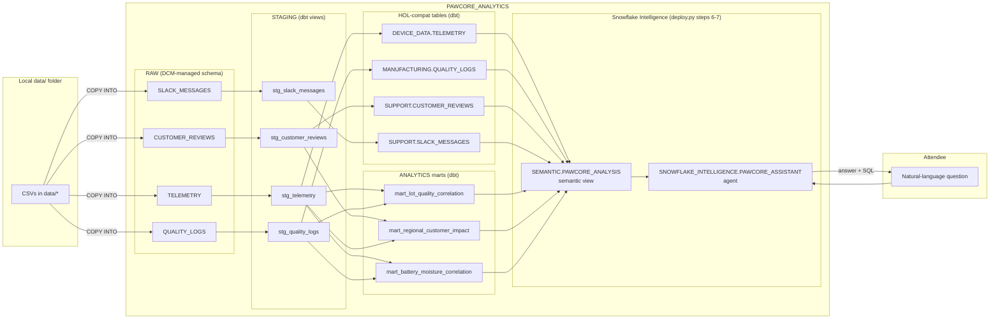
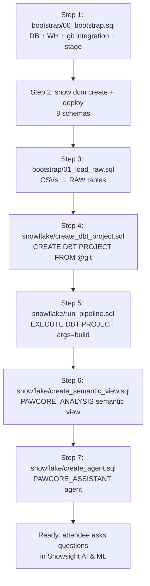

# Architecture

> Pre-rendered PNGs of both diagrams live in [`docs/images/`](images/) — useful for GitHub previews, slides, and tools without a Mermaid renderer.

## Data flow

## Deploy flow

Use `uv run scripts/deploy.py --stop-at raw-load` or `--stop-at build` to pause between steps during the webinar.

## Ownership split — DCM vs dbt

| Object type | Owner | Rationale |
|---|---|---|
| Database | Bootstrap SQL | DCM can't own its own parent |
| Warehouse | Bootstrap SQL | DCM can't manage warehouses |
| API integration + git repo | Bootstrap SQL | DCM can't manage these either |
| Schemas | **DCM** | Reviewable, plan-deployable infrastructure |
| Stages | Bootstrap SQL | Referenced in RAW load, must exist first |
| RAW tables | Bootstrap SQL | Loaded via COPY INTO from CSV, not dbt |
| Staging views | **dbt** | Business logic; belongs in model code |
| HOL-compat tables | **dbt** | Typed, tested, versioned analytical contract |
| Mart tables | **dbt** | Business value, tested, materialized |
| Semantic view | Bootstrap SQL (deploy.py step 6) | `PAWCORE_ANALYSIS` — AI-readable contract over marts + HOL tables |
| Intelligence agent | Bootstrap SQL (deploy.py step 7) | `PAWCORE_ASSISTANT` — Cortex Analyst tool reading the semantic view |
